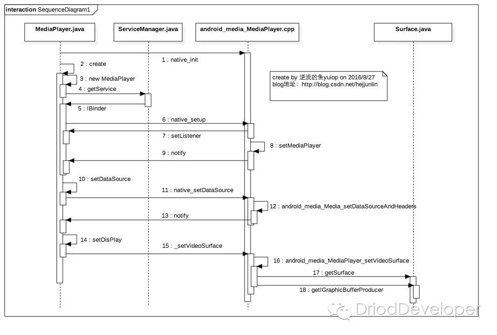
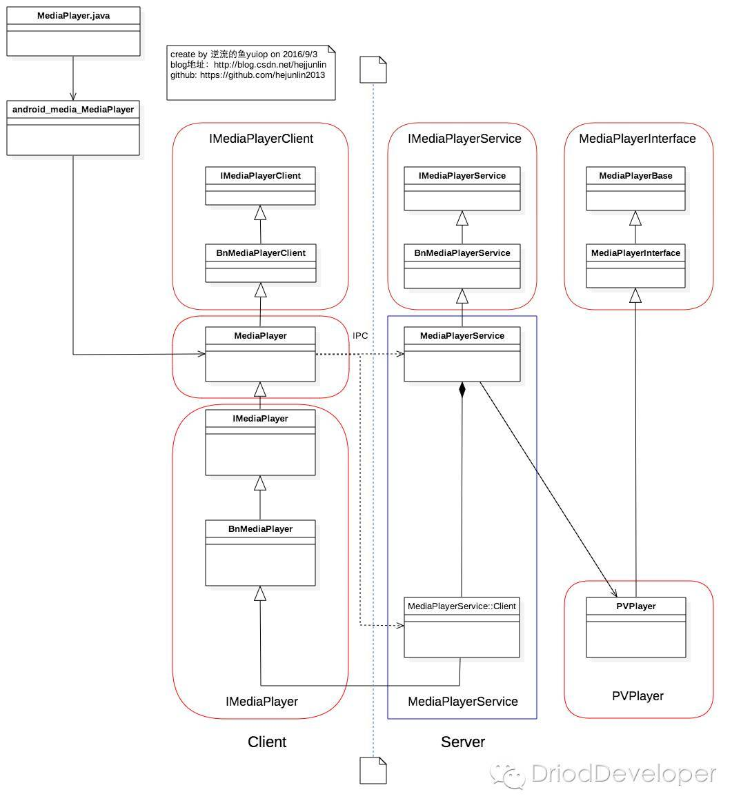

# 第二章 常用系统播放器 MediaPlayer


## 2.1 状态图和生命周期

### 1. MediaPlayer 的状态图

MediaPlayer 用于控制视频/音频文件及流的播放，由状态机进行控制。下图是 MediaPlayer 的状态周期。


- 椭圆代表 MediaPlayer 的驻留状态，弧代表播放控制并且驱动 MediaPlayer 状态进行过度
	- 单箭头弧表示同步函数调用
	- 双箭头弧表示异步函数调用 

### 2. Idle 状态和 End 状态

- MediaPlayer 创建实例或调用 reset 函数后，播放器就被创建了，此时处于 Idle 状态（就绪状态）
- MediaPlayer 调用 release 函数后，播放器就会变成 End 状态

这两种状态之间就是 MediaPlayer 的生命周期。

### 3. Error 状态

触发条件：

- 构建新的 MediaPlayer 或调用 reset 函数后，上传应用程序调用 `getCurrentPosition`, `getVideoHeight`, `getDuration`, `getVideoWidth`, `setAudioStreamType`, `setLooping`, `setVolume`, `pause`, `start`, `stop`, `seekTo`, `prepare`, `prepareAsync`这些函数会出错。
  - 如果调用 reset 函数后再调用他们，用户提供的回调函数`OnErrorListener.onError`将会触发`MediaPlayer`状态到`Error`状态，所以一旦不再使用，就需要`release`函数，以便 MediaPlayer 资源得到合理释放。
  - 当 MediaPlayer 到达 End 状态时，他将不能再被使用，也无法回到其他状态，本次生命周期就此终结
- 由于支持的音视频格式分辨率过高，输入数据流超时，或者其他各种各样的原因导致播放失败
  - 此种条件下，事先注册的 `OnErrorListener.onError` 将会被 MediaPlayer 回调，并返回错误信息
  - 此时 MediaPlayer 进入到 Error 状态；此时可以调用 reset 函数，将重新恢复到 Idle 状态
  - 故此我们要给 MediaPlayer 设置错误监听，出错之后就可以从播放器内部返回的信息中找到错误原因

### 4. Initialized 状态

- 触发条件：调用 `setDataSource(FileDescriptor)`, `setDataSource(String)`, `setDataSource(COntext, Uri)`, `setDataSource(FileDescriptor, long, long)` 其中一个函数
- 过程：MediaPlayer 状态将会从 Idle 变为 Initialized
- 异常：如果`setDataSource`在非 Idle 时调用，则会抛出`IllegalArgumentException`
- 注意：重载`setDataSource`方法是，需要抛出`IlleagalArgumentException`和`IOException`异常

### 5. Prepared 状态

- 触发条件
  - 同步方式
    - 调用 `prepare()` 方法，适用于本地音视频文件
    - 直接将状态从 Initialized --> prepared
  - 异步方式
    - `prepareAsync` 适用于网络数据，需要缓冲
    - 状态：Initialized --> preparing（时间较短） --> prepared
- 到达 Prepared 状态后，回调 `OnPreparedListener.onPrepared()`监听器

### 6. Started 状态

当 MediaPlayer 进入 Prepared 状态后，就可以设置音视频、looping、screenOnWhilePlaying 等属性了。

- 触发条件：调用`start`函数并成功返回
  - 处于 Started 状态时，如果用户事先注册过`setOnBufferingUpdatedListener`，那播放器就会回调`OnBufferingUpdateListener.onBufferingUpdate()`。这个函数主要用于应用程序保持跟踪音视频流的 buffering status
- 注意：如果 MediaPlayer 已经处于 Started 状态，那么再调用 Started 函数是没有任何作用的

### 7. Paused 状态

- 触发条件：调用`MediaPlayer.pause()`
- 过程：
  - 从`Started --> Paused` 的「状态切换」过程是瞬间的
  - 而从 `Started --> Paused` 状态的切换却是异步的。状态更新后并调用`isPlaying`函数前，会有一些耗时；已经缓冲过的数据流，也要耗费数秒
- 注意：
  - 当`start`函数从`Paused`状态恢复过来时，`playback`恢复之前暂停的位置，接着开始播放，此时 `MediaPlayer`状态又变成`Started`	 

### 8. Stopped 状态

- 触发：调用`MediaPlayer.stop()`函数
- 过程：无论播放器处于`Started`, `Paused`, `Prepared`或`PlackbackCompleted`状态，都进入`Stopped`状态
  - 如果已经处于`Stopped`，那么再次调用`stop`函数是无效的，依然会保持`Stoppped`状态
- 注意：
  - 一旦进入`Stopped`状态，`playback`将不能开始，直到重新调用`prepare`或`prepareAsync`函数，处于`Prepared`状态才可以开始
  - 在`Seek`操作完成后，播放器内部将会回调`OnSeekComplete.onSeekComplete`函数；其他状态下也可以调用`SeekTo`函数，比如`Prepared`，`Paused`以及`PlaybackComplete`

### 9. PlaybackComplete状态

当前播放位置可以通过`getCurrentPosition` 函数获取。

- 触发条件：播放前设置 `setLooping(fasle)`（表示不循环播放），播放器内部回调`OnCompletion.onCompletion()`
  - 此时调用`start`函数，将重启播放器从头开始播放数据
- 注意：
  - 如果设置了`setLooping(true)`（表示循环播放），一次数据播放完了之后，已经是处于`Started`状态


## 2.2 从创建到 setDataSource 过程

### 2.2.1 从创建到  setDisplay 过程

时序图如下：



调用顺序依次为：

- `getService()` 从  `Servicemanager`获取对应的`MediaPlayerService`
- 调用`native_setup`创建播放器
- 调用`setDataSource`把 URL 地址传入底层
- 准备好后，通过`setDisaplay`传入`SurfaceHolder`，以便讲解码出的数据放到`SurfaceHolder`中的`Surface`，最后显示在`SurfaceView`上

### 2.2.2 创建过程

`MediaPlayer`可以有两种方式进行创建：

- `MediaPlayer.create(context, uri)`
- `new MediaPlayer()`

#### MediaPlayer.create() 创建

当调用`MediaPlayer.create(this, "http://www.example.com/example.mp4")`时，进入创建过程：

```java
public static MediaPlayer create(Context context, Uri uri, SurfaceHolder holder,
        AudioAttributes audioAttributes, int audioSessionId) {
    try {
      // 新建一个 MediaPlayer 实例
        MediaPlayer mp = new MediaPlayer();
      // 声音处理
        final AudioAttributes aa = audioAttributes != null ? audioAttributes :
            new AudioAttributes.Builder().build();
      // 设置音频属性
        mp.setAudioAttributes(aa);
      // 设置声音的会话 ID
        mp.setAudioSessionId(audioSessionId);
      // 调用 setDataSource
        mp.setDataSource(context, uri);
        if (holder != null) {
          /**
          * SurfaceHolder 是一个 Suface 的控制器，
          * 用来操纵 Surface，处理他在 Canvas 上作画的效果和动画
          * 控制表面、大小和像素等
          */
            mp.setDisplay(holder);
        }
      // 开始准备
        mp.prepare();
        return mp;
    } catch (IOException ex) {
        Log.d(TAG, "create failed:", ex);
        // fall through
    } catch (IllegalArgumentException ex) {
        Log.d(TAG, "create failed:", ex);
        // fall through
    } catch (SecurityException ex) {
        Log.d(TAG, "create failed:", ex);
        // fall through
    }

    return null;
}
```

`MediaPlayer.create()`内部完成了：新建 player 实例、设置数据、做好`prepare`这些工作。此时外部仅需要调取`satrt()`函数，即可开始播放。

下面我们看看 MediaPlayer 的构造函数是如何操作的。

#### MediaPlayer 构造函数

```java
public MediaPlayer() {
    super(new AudioAttributes.Builder().build(),
            AudioPlaybackConfiguration.PLAYER_TYPE_JAM_MEDIAPLAYER);
  // 定义一个 looper
    Looper looper;
    if ((looper = Looper.myLooper()) != null) {
      // 实例化`EventHandler`对象
        mEventHandler = new EventHandler(this, looper);
    } else if ((looper = Looper.getMainLooper()) != null) {
        mEventHandler = new EventHandler(this, looper);
    } else {
        mEventHandler = null;
    }
		// 时间数据容器，一般 provider 都是和数据联系起来的
    mTimeProvider = new TimeProvider(this);
   
    mOpenSubtitleSources = new Vector<InputStream>();
    /* Native setup requires a weak reference to our object.
        * It's easier to create it here than in C++.
        */
    native_setup(new WeakReference<MediaPlayer>(this));

    baseRegisterPlayer();
}
```

接着是 Native 层如何创造一个 MediaPlayer。

在 MediaPlayer 中加载链接库文件：

```java
static {
  	System.locaLibrary("media_jni");
    native_init();
}
```

进入到`android_media_MediaPlayer.cpp`，先执行了`android_media_MediaPlayer_native_init` 函数

```c++
static void
android_media_MediaPlayer_native_init(JNIEnv *env){
	// 类的句柄
	jclass clazz;
	// 在 Native 层调用 Java 层，获取 MediaPlayer 对象
	clazz = env->FindClass("android/media/MediaPlayer");
	if (clazz == NULL){
		return;
	}
	// 获取成员变量 mNativeContext，她在 MediaPlayer 中是一个 long 型整数，实际对应一个内存地址
	fields.context = env->GetFieldID(clazz, "mNativeContext", "J");
	if (fields.context == NULL){
		return;
	}
	
	field.post_event = env->GetStaticMethodID(clazz, "postEventFromNative", "(Ljava/lang/object;IIILjava/lang/Object;IIIjava/lang/Object;)V");
	if (fields.post_even == NULL){
		return;
	}
  ...
}
```

上述代码通过 JNI 调用了 Java 层的 MediaPlayer 类，然后获取 `mNativeContext`的指针；接着调用了 `MediaPlayer.java` 中的静态方法`postEventFromNative`，把 Native 事件回调到 Java 层，使用 EventHandler post 事件回到主线程，用软引用的方式指向原生的 MediaPlayer ，以保证 Native 代码是安全的。

```java
private static void postEventFromNative(Object mediaplayer_ref, int what, int arg1, int arg2, Object obj){
  MediaPlayer mp = (MediaPlayer)((WeakReference)mediaplayer_ref).get();
  if (mp == null){
    return;
  }
  ...
  if (mp.mEventHandler != null) {
    Message m = mp.mEventHandler.obtainMessage(what, arg1, arg2, obj);
    mp.mEventHandler.sendMessage(m);
  }
}
```

而`native_steup`函数，也在`android_media_MediaPlayer.cpp`中，主要是设置一些回调以及创建 C++ 层的 MediaPlayer 对象。

```c++
static void android_media_MediaPlayer_native_setup(JNIEnv *env, jobject thiz, jobject weak_this){
  sp<MediaPlayer> mp = new MediaPlayer();
  // 给 MediaPlayer 创建一个 listener，以便我们在 Java 设置的 setPrepareListener, setOnCompleteListener 能产生回调
  sp<JNIMediaPlayerListener> listener = new JNIMediaPlayerListener(env, thiz, weak_this);
  mp->setListener(listener);
  setMediaPlayer(env, thiz, mp);
}
```


### 	2.2.3 setDataSource 过程

#### 文件传入的情况

```java
public void setDataSource(String path)
        throws IOException, IllegalArgumentException, SecurityException, IllegalStateException {
    setDataSource(path, null, null);
}

public void setDataSource(String path, Map<String, String> headers)
        throws IOException, IllegalArgumentException, SecurityException, IllegalStateException {
    setDataSource(path, headers, null);
}

private void setDataSource(String path, Map<String, String> headers, List<HttpCookie> cookies)
        throws IOException, IllegalArgumentException, SecurityException, IllegalStateException
{
    String[] keys = null;
    String[] values = null;
		// 获取请求头中的 key 和 value
    if (headers != null) {
        keys = new String[headers.size()];
        values = new String[headers.size()];

        int i = 0;
        for (Map.Entry<String, String> entry: headers.entrySet()) {
            keys[i] = entry.getKey();
            values[i] = entry.getValue();
            ++i;
        }
    }
    setDataSource(path, keys, values, cookies);
}

private void setDataSource(String path, String[] keys, String[] values,
        List<HttpCookie> cookies)
        throws IOException, IllegalArgumentException, SecurityException, IllegalStateException {
    final Uri uri = Uri.parse(path);
    final String scheme = uri.getScheme();
    if ("file".equals(scheme)) {
        path = uri.getPath();
    } else if (scheme != null) {
        // 处理非文件类型资源
        nativeSetDataSource(
            MediaHTTPService.createHttpServiceBinderIfNecessary(path, cookies),
            path,
            keys,
            values);
        return;
    }
		// 处理文件类型资源
    final File file = new File(path);
    if (file.exists()) {
        FileInputStream is = new FileInputStream(file);
        FileDescriptor fd = is.getFD();
        setDataSource(fd);
        is.close();
    } else {
        throw new IOException("setDataSource failed.");
    }
}
```

处理文件资源描述符的方法（`setDataSource(fd)`）：

```java
public void setDataSource(FileDescriptor fd)
        throws IOException, IllegalArgumentException, IllegalStateException {
    // intentionally less than LONG_MAX
    setDataSource(fd, 0, 0x7ffffffffffffffL);
}

public void setDataSource(FileDescriptor fd, long offset, long length)
        throws IOException, IllegalArgumentException, IllegalStateException {
    _setDataSource(fd, offset, length);
}

private native void _setDataSource(FileDescriptor fd, long offset, long length)
    throws IOException, IllegalArgumentException, IllegalStateException;
```

`_setDataSource()` 是 Native 层方法，在[`android_media_MediaPlayer`](https://android.googlesource.com/platform/frameworks/base/+/gingerbread/media/jni/android_media_MediaPlayer.cpp)中通过函数映射声明进行动态注册：

```c++
static JNINativeMethod gMethods[] = {
    {"setDataSource",       "(Ljava/lang/String;)V",            (void *)android_media_MediaPlayer_setDataSource},
    {"setDataSource",       "(Ljava/lang/String;Ljava/util/Map;)V",(void *)android_media_MediaPlayer_setDataSourceAndHeaders},
    {"setDataSource",       "(Ljava/io/FileDescriptor;JJ)V",    (void *)android_media_MediaPlayer_setDataSourceFD},
    {"_setVideoSurface",    "()V",                              (void *)android_media_MediaPlayer_setVideoSurface},
    {"prepare",             "()V",                              (void *)android_media_MediaPlayer_prepare},
    {"prepareAsync",        "()V",                              (void *)android_media_MediaPlayer_prepareAsync},
    {"_start",              "()V",                              (void *)android_media_MediaPlayer_start},
    {"_stop",               "()V",                              (void *)android_media_MediaPlayer_stop}
// 省略部分代码
...
}
```

映射到函数`android_media_MediaPlayer_setDataSourceFD`：

```c++
static void
android_media_MediaPlayer_setDataSourceFD(JNIEnv *env, jobject thiz, jobject fileDescriptor, jlong offset, jlong length)
{
    sp<MediaPlayer> mp = getMediaPlayer(env, thiz);
  	// 判空异常
    if (mp == NULL ) {
        jniThrowException(env, "java/lang/IllegalStateException", NULL);
        return;
    }
    if (fileDescriptor == NULL) {
        jniThrowException(env, "java/lang/IllegalArgumentException", NULL);
        return;
    }
    // 从 JNI 中获取 java.io.FileDescriptor
    int fd = jniGetFDFromFileDescriptor(env, fileDescriptor);
    LOGV("setDataSourceFD: fd %d", fd);
  	// mp->setDataSource(fd, offset, length) 函数得到状态
    process_media_player_call( env, thiz, mp->setDataSource(fd, offset, length), "java/io/IOException", "setDataSourceFD failed." );
}

/*
 * 调用 JNIEnv* 中的 GetIntFiled 获取对应变量
 https://android.googlesource.com/platform/dalvik/+/gingerbread/libnativehelper/JNIHelp.c
 */
int jniGetFDFromFileDescriptor(JNIEnv* env, jobject fileDescriptor) {
    return (*env)->GetIntField(env, fileDescriptor, gCachedFields.descriptorField);
}
```

然后是`process_media_payer_call`函数：

```c++
// If exception is NULL and opStatus is not OK, this method sends an error
// event to the client application; otherwise, if exception is not NULL and
// opStatus is not OK, this method throws the given exception to the client
// application.
static void process_media_player_call(JNIEnv *env, jobject thiz, status_t opStatus, const char* exception, const char *message)
{
    if (exception == NULL) {  // Don't throw exception. Instead, send an event.
        if (opStatus != (status_t) OK) {
            // 不抛出异常，而是发出一个 Error 事件
            sp<MediaPlayer> mp = getMediaPlayer(env, thiz);
            if (mp != 0) mp->notify(MEDIA_ERROR, opStatus, 0);
        }
    } else {  // Throw exception!
        // 异常处理代码
        if ( opStatus == (status_t) INVALID_OPERATION ) {
            jniThrowException(env, "java/lang/IllegalStateException", NULL);
        } else if ( opStatus != (status_t) OK ) {
            if (strlen(message) > 230) {
               // if the message is too long, don't bother displaying the status code
               jniThrowException( env, exception, message);
            } else {
               char msg[256];
                // append the status code to the message
               sprintf(msg, "%s: status=0x%X", message, opStatus);
               jniThrowException( env, exception, msg);
            }
        }
    }
}
```

综上：

- `mp->setDataSource(fd, offset, length)`函数得到状态之后，对各种状态进行通知
- 有异常状态会直接抛出


#### HTTP/RTSP 传入情况下

同样根据映射表找到`android_media_MediaPlayer_setDataSourceAndHeaders`函数：

```c++
static void
android_media_MediaPlayer_setDataSourceAndHeaders(
        JNIEnv *env, jobject thiz, jobject httpServiceBinderObj, jstring path,
        jobjectArray keys, jobjectArray values) {
    // 获取 MediaPlayer 对象
    sp<MediaPlayer> mp = getMediaPlayer(env, thiz);
    // 异常处理
    if (mp == NULL ) {
        jniThrowException(env, "java/lang/IllegalStateException", NULL);
        return;
    }
    if (path == NULL) {
        jniThrowException(env, "java/lang/IllegalArgumentException", NULL);
        return;
    }
    // 内存溢出
    const char *tmp = env->GetStringUTFChars(path, NULL);
    if (tmp == NULL) {  // Out of memory
        return;
    }
    ALOGV("setDataSource: path %s", tmp);
    String8 pathStr(tmp);
    env->ReleaseStringUTFChars(path, tmp);
    tmp = NULL;
    // We build a KeyedVector out of the key and val arrays
    KeyedVector<String8, String8> headersVector;
    if (!ConvertKeyValueArraysToKeyedVector(
            env, keys, values, &headersVector)) {
        return;
    }
    sp<IMediaHTTPService> httpService;
    if (httpServiceBinderObj != NULL) {
        // 通过 Binder 机制将 httpServiceBinderObj 传给 IPC 并返回 binder
        sp<IBinder> binder = ibinderForJavaObject(env, httpServiceBinderObj);
        // 强制转成 IMediaHttpsService
        httpService = interface_cast<IMediaHTTPService>(binder);
    }
    // 开始判断状态
    status_t opStatus =
        mp->setDataSource(
                httpService,
                pathStr,
                headersVector.size() > 0? &headersVector : NULL);
    // 获取状态后如果有错则使用 notify 通知
    process_media_player_call(
            env, thiz, opStatus, "java/io/IOException",
            "setDataSource failed." );
}
```


综上，`setDataSource`过程就完成了。此处的调用过程有两种：

- 正向调用：JAVA --> JNI --> C++ 
- 反向调用：C++ --> JNI --> JAVA
  - 例如`mp->setDataSource( httpService, pathStr, headersVector.size() > 0? &headersVector : NULL);`

JAVA 和 C++ 层互相调用的好处：

- 安全性：封装在 Native 层的代码以 `.so` 文件形式存在，破坏性风险小
- 效率高：在运行速度上 C++ 执行时间短，且底层也是用 C++ 语言编写；对于复杂的渲染以及时间要求比较高的渲染，放在 Native 层是最好不过的选择
- 连通性：正向调用将值传入，反向调用将处理结果通知回去；相当于一条管道


### 2.2.4 setDisplay 过程

在`setDataSource`之后，开始进行的是`mp.setDisplay(holder)`：

```java
public void setDisplay(SurfaceHolder sh) {
    // 给 Surface 设置一个控制器，用于展示视频图像
    mSurfaceHolder = sh;
    Surface surface;
    if (sh != null) {
        surface = sh.getSurface();
    } else {
        surface = null;
    }
    // 给视频设置 Surface，带 _ 的函数是 native 函数
    _setVideoSurface(surface);
    // 更新 Surface 到屏幕上
    updateSurfaceScreenOn();
}
```

`_setVideoSurface()`对应的函数：

```c++
static void
android_media_MediaPlayer_setVideoSurface(JNIEnv *env, jobject thiz, jobject jsurface)
{
    setVideoSurface(env, thiz, jsurface, true /* mediaPlayerMustBeAlive */);
}

static void
setVideoSurface(JNIEnv *env, jobject thiz, jobject jsurface, jboolean mediaPlayerMustBeAlive)
{
    sp<MediaPlayer> mp = getMediaPlayer(env, thiz);
    if (mp == NULL) {
        if (mediaPlayerMustBeAlive) {
            jniThrowException(env, "java/lang/IllegalStateException", NULL);
        }
        return;
    }

    decVideoSurfaceRef(env, thiz);

    sp<IGraphicBufferProducer> new_st;
    if (jsurface) {
      	// 得到 Java 层的 Surface
        sp<Surface> surface(android_view_Surface_getSurface(env, jsurface));
        if (surface != NULL) {
          	// 从 Java 的 Surface 中获取 IGraphicBufferProducer
            new_st = surface->getIGraphicBufferProducer();
            if (new_st == NULL) {
                jniThrowException(env, "java/lang/IllegalArgumentException",
                    "The surface does not have a binding SurfaceTexture!");
                return;
            }
            new_st->incStrong((void*)decVideoSurfaceRef);
        } else {
            jniThrowException(env, "java/lang/IllegalArgumentException",
                    "The surface has been released");
            return;
        }
    }

    env->SetLongField(thiz, fields.surface_texture, (jlong)new_st.get());

    // This will fail if the media player has not been initialized yet. This
    // can be the case if setDisplay() on MediaPlayer.java has been called
    // before setDataSource(). The redundant call to setVideoSurfaceTexture()
    // in prepare/prepareAsync covers for this case.
    mp->setVideoSurfaceTexture(new_st);
}
static void
decVideoSurfaceRef(JNIEnv *env, jobject thiz)
{
    sp<MediaPlayer> mp = getMediaPlayer(env, thiz);
    if (mp == NULL) {
        return;
    }

    sp<IGraphicBufferProducer> old_st = getVideoSurfaceTexture(env, thiz);
    if (old_st != NULL) {
        old_st->decStrong((void*)decVideoSurfaceRef);
    }
}
```

- `SurfaceTexture`：可以从视频解码中获取图像流（image Stream），但他在获取之后并不需要显示出来。我们可以从`SurfaceTexture`中取得图像帧的副本进行处理，处理完毕后再送给另一个`SurfaceView`用于显示
- `Surface`：处理被屏幕排序的原生`Buffer`，Android 中的`Surface`就是一个用来画图（Graphic）或图像（image）的地方
  - 对于 View 及其子类，都是画到 Surface 上的，各 Surface 对象通过 SurfaceFlinger 合成到 FrameBuffer
  - 每个 Surface 都是双缓冲
    - 两个线程：一个渲染线程，一个 UI 更新线程；分别对应两个 Buffer 中的 BackBuffer 和 FrontBuffer
    - 在 Surface 中创建的 Canvas 对象，可用来管理 Surface 绘图操作，Canvas 对应 Bitmap，存储 Surface 中的内容

- `SurfaceView`：经常在`Camera`, `MediaRecorder`, `MediaPlayer`中，被用以显示图像
  - 是 View 的子类，实现了`Parcelable`接口
  - 内置了一个专门用于绘制的 Surface，SurfaceView 可以控制这个 Surface 的格式和尺寸，及其所绘制的位置
  - Surface 就是存储数据的地方，而 SurfaceView 就是展示数据的地方
- `SurfaceHolder`：管理`Surface`的容器
  - 是一个接口， Surface 的监听器
    - 通过回调函数`addCallback(SurfaceHolder, Callback back)`坚挺 Surface 的创建
    - 通过获取 Surface 的 Canvas 对象，可以锁定该 Surface
    - 所得到的 Canvas 对象在完成修改 Surfac 中的数据后，释放同步锁，并提交改变 Surface 的状态及图像，展示新的图像数据

综上：`SurfaceView`中调用`getHolder`函数，可以获取当前`SurfaceView`中的`Surface`对应的`SufaceHolder`；`SurfaceHolder`开始对`Surface`进行管理操作。

上述就是`setDiaplay`的过程，Java 层中`setDisplay`的最后一行，就是通过 JNI 返回的`Surface`，时时做好更新准备。


## 2.3 开始 prepare 后的流程

我们将从 MediaPlayer 的生态上认识各类库之间的依赖调用关系。

MediaPlayer 部分头文件在`frameworks/include/media`目录中，此目录和`libmedia.so`库源文件目录`frameworks/av/media/libmedia/`相对应，主要包括下列几个：

- `IMediaPlayerClient.h`
- `mediaplayer.h`
  - 提供对上层的接口
- `IMediaPlayer.h`
- `IMediaPlayerService.h`
- `MediaPlayerInterface.h`

下图是 MediaPlayer 各个具体类之间的依赖关系。



- 实线非实心箭头表示「关联关系」，也就是对象间的引用
  - 箭头起始点的类，持有箭头终止点的类的一个对象；后者作为前者的一个属性而存在
  - `MediaPlayerService`持有`PVPlayer`的引用
- 实线空心三角箭头表示「泛化关系」，也就是类与类之间的继承关系
  - 箭头起始方向的类，继承了箭头所指方向的类
  - `MediaPlayerService::Client` 继承了`BnMediaPlayer`，后者继承了`IMediaPlayer`，直到`IMediaPlayerClient`类


运行时，MediaPlayer 大致分为`Client`和`Server`两个部分，分别在两个进程中运行，他们之间通过`Binder`机制实现 IPC 通信。

- `IMediaPlayerService.h`，`IMediaPlayerClient.h` 和`mediaplayer.h`三个头文件定义了`MediaPlayer`的接口和架构
  - 目录中有专门的`MediaPlayerService.cpp`和`mediaplayer.cpp`文件对应上面的三个头文件，用于 MediaPlayer  架构的实现
- 给播放器设置数据源且展示`Surface`后，我们应当开始调用`prepare`或`prepareAsync`
    - `prepare`是一个同步函数，对于文件类型，调用它后将暂时被阻塞
    - 当播放器回调了`onPrepared`函数，进入`prepared`状态后， MediaPlayer 已经准备好数据准备播放了。此时阻塞消失

`prepare()`函数：

```java
public void prepare() throws IOException, IllegalStateException {
    _prepare();
    scanInternalSubtitleTracks();

    // DrmInfo, if any, has been resolved by now.
    synchronized (mDrmLock) {
        mDrmInfoResolved = true;
    }
}
```

`android_media_MediaPlayer_prepare`

```c++
static void
android_media_MediaPlayer_prepare(JNIEnv *env, jobject thiz)
{
    sp<MediaPlayer> mp = getMediaPlayer(env, thiz);
    if (mp == NULL ) {
        jniThrowException(env, "java/lang/IllegalStateException", NULL);
        return;
    }

    // Handle the case where the display surface was set before the mp was
    // initialized. We try again to make it stick.
  	// 获取 IGraphicBufferProducer 类型的指针 
    sp<IGraphicBufferProducer> st = getVideoSurfaceTexture(env, thiz);
  	// 传递给 MediaPlayer
    mp->setVideoSurfaceTexture(st);
		// 检查 MediaPlayer 调用 prepare 后是否有异常（参数不合法、IO 异常等）
    process_media_player_call( env, thiz, mp->prepare(), "java/io/IOException", "Prepare failed." );
}
```

- `IGraphicBufferProducer`是 APP 和 `BufferQueue` 的重要桥梁，承担者单个应用进程中的 UI 显示需求
- `BpGraphicBufferProducer` 是 `GraphicBufferProducer` 在客户端的代理对象，负责和 `SurfaceFlinger` 交互
    - `GraphicBufferProducer`通过 `gbp` （`IGraphicBUfferProducer`）向 `BufferQueue` 获取 `Buffer`，然后填充 UI 信息，填充完毕会通知`SurfaceFlinger`

如果传入 MediaPlayer 是一个网络 URI，也就是输入网络流数据，那么 MediaPlayer 将会使用 `prepareAsnc`函数。

例如下列调用方式：

```java
public void startPlayUrl(Uri uri){
  	MediaPlayer mp = new MediaPlayer();
  	try {
      mp.setDataSource(this, uri);
    } catch(Exception e){
      e.printStackTrace();
    }
  	mp.setOnPrepareListener(prepareListener);
  	mp.setOnVideoSizeChangerListener(videoSizeChangeListener);
  	mp.setOnOnErrorListener(onErrorListener);
  	mp.prepareAsync();
}
```

之所以建议网络流尽量调用`prepareAsync()`，是因为这个函数是异步的，不会导致没有足够的数据而影响起播。

/[frameworks](http://androidxref.com/9.0.0_r3/xref/frameworks/)/[base](http://androidxref.com/9.0.0_r3/xref/frameworks/base/)/[media](http://androidxref.com/9.0.0_r3/xref/frameworks/base/media/)/[jni](http://androidxref.com/9.0.0_r3/xref/frameworks/base/media/jni/)/[android_media_MediaPlayer.cpp](http://androidxref.com/9.0.0_r3/xref/frameworks/base/media/jni/android_media_MediaPlayer.cpp)

```c++
static void
android_media_MediaPlayer_prepareAsync(JNIEnv *env, jobject thiz)
{
    sp<MediaPlayer> mp = getMediaPlayer(env, thiz);
    if (mp == NULL ) {
        jniThrowException(env, "java/lang/IllegalStateException", NULL);
        return;
    }

    // Handle the case where the display surface was set before the mp was
    // initialized. We try again to make it stick.
    sp<IGraphicBufferProducer> st = getVideoSurfaceTexture(env, thiz);
    mp->setVideoSurfaceTexture(st);

    process_media_player_call( env, thiz, mp->prepareAsync(), "java/io/IOException", "Prepare Async failed." );
}
```

[`prepareAsync`](http://androidxref.com/7.1.2_r36/xref/frameworks/av/media/libmedia/mediaplayer.cpp#288)

```c++
status_t MediaPlayer::prepareAsync()
{
    ALOGV("prepareAsync");
    // 互斥锁
    Mutex::Autolock _l(mLock);
    return prepareAsync_l();
}
```

[`prepareAsync_l`](http://androidxref.com/7.1.2_r36/xref/frameworks/av/media/libmedia/mediaplayer.cpp#244)

```c++
// must call with lock held
status_t MediaPlayer::prepareAsync_l()
{
    if ( (mPlayer != 0) && ( mCurrentState & (MEDIA_PLAYER_INITIALIZED | MEDIA_PLAYER_STOPPED) ) ) {
        if (mAudioAttributesParcel != NULL) {
            mPlayer->setParameter(KEY_PARAMETER_AUDIO_ATTRIBUTES, *mAudioAttributesParcel);
        } else {
            // 设置音频流类型
            mPlayer->setAudioStreamType(mStreamType);
        }
        mCurrentState = MEDIA_PLAYER_PREPARING;
        return mPlayer->prepareAsync();
    }
    ALOGE("prepareAsync called in state %d, mPlayer(%p)", mCurrentState, mPlayer.get());
    return INVALID_OPERATION;
}
```

`mPlayer->prepareAsync()` 是 `IMediaPlayer` 的匿名 Binder Server，属于 MediaPlayer 架构中的 Server 端，最终回调到 Client 端的 `IMediaPlayer`，也就是`BnMediaPlayer`。该`BnMediaPlayer`对应的代码如下：

```c++
MediaPlayerService::Client::prepareAsync
case PREPARE_ASYNC: {
	CHECK_INTERFACE(IMediaPlayer, data, replay);
	replay->wraiteInt32(prepareAsymc());
	return NO_ERROR;
} break;
```

[MediaPlayerService::Client::prepareAsync](http://androidxref.com/9.0.0_r3/xref/frameworks/av/media/libmediaplayerservice/MediaPlayerService.cpp#1066)

```c++
status_t MediaPlayerService::Client::prepareAsync()
{
    ALOGV("[%d] prepareAsync", mConnId);
    sp<MediaPlayerBase> p = getPlayer();
    if (p == 0) return UNKNOWN_ERROR;
    status_t ret = p->prepareAsync();
#if CALLBACK_ANTAGONIZER
    ALOGD("start Antagonizer");
    if (ret == NO_ERROR) mAntagonizer->start();
#endif
    return ret;
}
```

再接着回调用`MediaPlayerBase`的实现类的`preapreAsync()`。之后大致的流程是：

-   判断`mFlags`
    -   如果已经是`prepareed` 状态，则返回；否则继续执行
-   启动 `mQueue`（`TimedEventQueue`）队列
-   修改`mFlags`为 `prepared`，表示正在处理文件音视频流
-   实例化一个`AwesomeEvent`，放到之前启动的`mQueue`中进行通知

队列的处理结果就是调用`AwesomePlayer::onPrepareAsyncEvent`函数。然后初始化解码器，将流解码出来，此时获取宽高等属性，然后处于`prepared`状态。`prepare`的流程基本完成。

再看看 Java 层中 `prepare` 函数的 `scanInternalSubtitleTracks` 函数，此函数用于扫描内嵌字幕并且进行追踪。

```java
private void scanInternalSubtitleTracks() {
    // 设置字幕控制锚点
    setSubtitleAnchor();

    populateInbandTracks();

    if (mSubtitleController != null) {
        mSubtitleController.selectDefaultTrack();
    }
}
```

然后是`MediaPlayer`中的`start`函数：

```java
// 此处的 start 函数主要是判断是否进行延迟播放
public void start() throws IllegalStateException {
    //FIXME use lambda to pass startImpl to superclass
    final int delay = getStartDelayMs();
    if (delay == 0) {
        startImpl();
    } else {
        new Thread() {
            public void run() {
                try {
                    Thread.sleep(delay);
                } catch (InterruptedException e) {
                    e.printStackTrace();
                }
                baseSetStartDelayMs(0);
                try {
                    startImpl();
                } catch (IllegalStateException e) {
                    // fail silently for a state exception when it is happening after
                    // a delayed start, as the player state could have changed between the
                    // call to start() and the execution of startImpl()
                }
            }
        }.start();
    }
}

// 真正的 start 函数实现
private void startImpl() {
    baseStart();
    stayAwake(true);
    _start();
}
```

此处有三个函数调用，分别是`PlayerBase.java`中的`baseStart()`，主要是更新播放状态、设置音量。

```java
void baseStart() {
    if (DEBUG) { Log.v(TAG, "baseStart() piid=" + mPlayerIId); }
    updateState(AudioPlaybackConfiguration.PLAYER_STATE_STARTED);
    synchronized (mLock) {
        if (isRestricted_sync()) {
            playerSetVolume(true/*muting*/,0, 0);
        }
    }
}
```

`startAwake(boolean)`是获取唤醒锁：

```java
private void stayAwake(boolean awake) {
    if (mWakeLock != null) {
        if (awake && !mWakeLock.isHeld()) {
            mWakeLock.acquire();
        } else if (!awake && mWakeLock.isHeld()) {
            mWakeLock.release();
        }
    }
    mStayAwake = awake;
    updateSurfaceScreenOn();
}
// nWakeLock 在 setWakeMode 方法中得到
public void setWakeMode(Context context, int mode) {
    boolean washeld = false;

    /* Disable persistant wakelocks in media player based on property */
    if (SystemProperties.getBoolean("audio.offload.ignore_setawake", false) == true) {
        Log.w(TAG, "IGNORING setWakeMode " + mode);
        return;
    }

    if (mWakeLock != null) {
        if (mWakeLock.isHeld()) {
            washeld = true;
            mWakeLock.release();
        }
        mWakeLock = null;
    }
	// 获取 PowerManager 实例
    PowerManager pm = (PowerManager)context.getSystemService(Context.POWER_SERVICE);
    // 生成 WakeLock 实例，传入指定的 flag
    mWakeLock = pm.newWakeLock(mode|PowerManager.ON_AFTER_RELEASE, MediaPlayer.class.getName());
    mWakeLock.setReferenceCounted(false);
    if (washeld) {
        mWakeLock.acquire();
    }
}
```

不同的 flag 对应的不同锁的类型，对 CPU、屏幕和键盘灯有不同的效果：

-   `PARTIAL_WAKE_LOCK`：保持 CPU 运转，屏幕和键盘灯有可能是关闭的
-   `SCREEN_DIM_WAKE_LOCK`：保持 CPU 运转，屏幕可能是灰的，允许关闭键盘灯
-   `SCREEN_BRIGHT_WAKE_LOCK`：保持 CPU 运转，允许屏幕高亮显示，允许关闭键盘灯
-   `FULL_WAKE_LOCK`：保持 CPU 运转，保持屏幕高亮，也保持键盘灯高亮
-   `ACQUIRE_CAUSES_WAKE`：获得此锁时，屏幕和键盘灯会立刻打开

`updateSurfaceScreenOn`用于更新屏幕上的`Surface`。

再然后我们看看`start`函数，对应 JNI 中的[android_media_MediaPlayer_start](http://androidxref.com/9.0.0_r3/xref/frameworks/base/media/jni/android_media_MediaPlayer.cpp#452) 函数:

```c++
static void
android_media_MediaPlayer_start(JNIEnv *env, jobject thiz)
{
    ALOGV("start");
    //  底层返回一个状态
    sp<MediaPlayer> mp = getMediaPlayer(env, thiz);
    if (mp == NULL ) {
        jniThrowException(env, "java/lang/IllegalStateException", NULL);
        return;
    }
    // 判断是否已经处于 Started 状态
    process_media_player_call( env, thiz, mp->start(), NULL, NULL );
}

```

开始视频播放流程后，最终会回调到`mediaplayer.cpp`中实现。[`mediaplayer.h`](http://androidxref.com/9.0.0_r3/xref/frameworks/av/include/media/mediaplayer.h) 中的 MediaPlayer 声明表明它实现了大部分的基础播放控制。

```c++
class MediaPlayer : public BnMediaPlayerClient,
                    public virtual IMediaDeathNotifier
{
public:
    MediaPlayer();
    ~MediaPlayer();
            void            died();
            void            disconnect();

            status_t        setDataSource(
                    const sp<IMediaHTTPService> &httpService,
                    const char *url,
                    const KeyedVector<String8, String8> *headers);

            status_t        setDataSource(int fd, int64_t offset, int64_t length);
            status_t        setDataSource(const sp<IDataSource> &source);
            status_t        setVideoSurfaceTexture(
                                    const sp<IGraphicBufferProducer>& bufferProducer);
            status_t        setListener(const sp<MediaPlayerListener>& listener);
            status_t        getBufferingSettings(BufferingSettings* buffering /* nonnull */);
            status_t        setBufferingSettings(const BufferingSettings& buffering);
            status_t        prepare();
            status_t        prepareAsync();
            status_t        start();
            status_t        stop();
            status_t        pause();
            bool            isPlaying();
            status_t        setPlaybackSettings(const AudioPlaybackRate& rate);
            status_t        getPlaybackSettings(AudioPlaybackRate* rate /* nonnull */);
            status_t        setSyncSettings(const AVSyncSettings& sync, float videoFpsHint);
            status_t        getSyncSettings(
                                    AVSyncSettings* sync /* nonnull */,
                                    float* videoFps /* nonnull */);
            status_t        getVideoWidth(int *w);
            status_t        getVideoHeight(int *h);
            status_t        seekTo(
                    int msec,
                    MediaPlayerSeekMode mode = MediaPlayerSeekMode::SEEK_PREVIOUS_SYNC);
            status_t        notifyAt(int64_t mediaTimeUs);
            status_t        getCurrentPosition(int *msec);
            status_t        getDuration(int *msec);
            status_t        reset();
            status_t        setAudioStreamType(audio_stream_type_t type);
            status_t        getAudioStreamType(audio_stream_type_t *type);
            status_t        setLooping(int loop);
            bool            isLooping();
            status_t        setVolume(float leftVolume, float rightVolume);
            void            notify(int msg, int ext1, int ext2, const Parcel *obj = NULL);
            status_t        invoke(const Parcel& request, Parcel *reply);
            status_t        setMetadataFilter(const Parcel& filter);
            status_t        getMetadata(bool update_only, bool apply_filter, Parcel *metadata);
            status_t        setAudioSessionId(audio_session_t sessionId);
            audio_session_t getAudioSessionId();
            status_t        setAuxEffectSendLevel(float level);
            status_t        attachAuxEffect(int effectId);
            status_t        setParameter(int key, const Parcel& request);
            status_t        getParameter(int key, Parcel* reply);
            status_t        setRetransmitEndpoint(const char* addrString, uint16_t port);
            status_t        setNextMediaPlayer(const sp<MediaPlayer>& player);

            media::VolumeShaper::Status applyVolumeShaper(
                                    const sp<media::VolumeShaper::Configuration>& configuration,
                                    const sp<media::VolumeShaper::Operation>& operation);
            sp<media::VolumeShaper::State> getVolumeShaperState(int id);
            // Modular DRM
            status_t        prepareDrm(const uint8_t uuid[16], const Vector<uint8_t>& drmSessionId);
            status_t        releaseDrm();
            // AudioRouting
            status_t        setOutputDevice(audio_port_handle_t deviceId);
            audio_port_handle_t getRoutedDeviceId();
            status_t        enableAudioDeviceCallback(bool enabled);

private:
            void            clear_l();
            status_t        seekTo_l(int msec, MediaPlayerSeekMode mode);
            status_t        prepareAsync_l();
            status_t        getDuration_l(int *msec);
            status_t        attachNewPlayer(const sp<IMediaPlayer>& player);
            status_t        reset_l();
            status_t        doSetRetransmitEndpoint(const sp<IMediaPlayer>& player);
            status_t        checkStateForKeySet_l(int key);

    sp<IMediaPlayer>            mPlayer;
    thread_id_t                 mLockThreadId;
    Mutex                       mLock;
    Mutex                       mNotifyLock;
    Condition                   mSignal;
    sp<MediaPlayerListener>     mListener;
    void*                       mCookie;
    media_player_states         mCurrentState;
    int                         mCurrentPosition;
    MediaPlayerSeekMode         mCurrentSeekMode;
    int                         mSeekPosition;
    MediaPlayerSeekMode         mSeekMode;
    bool                        mPrepareSync;
    status_t                    mPrepareStatus;
    audio_stream_type_t         mStreamType;
    Parcel*                     mAudioAttributesParcel;
    bool                        mLoop;
    float                       mLeftVolume;
    float                       mRightVolume;
    int                         mVideoWidth;
    int                         mVideoHeight;
    audio_session_t             mAudioSessionId;
    float                       mSendLevel;
    struct sockaddr_in          mRetransmitEndpoint;
    bool                        mRetransmitEndpointValid;
};

```

## 2.4 C++ 中 MediaPlayer 的 C/S 架构

本节将会分析 JNI 层的调用。先从`setDataSource`来看 C/S 模式的过程：

```c++

```